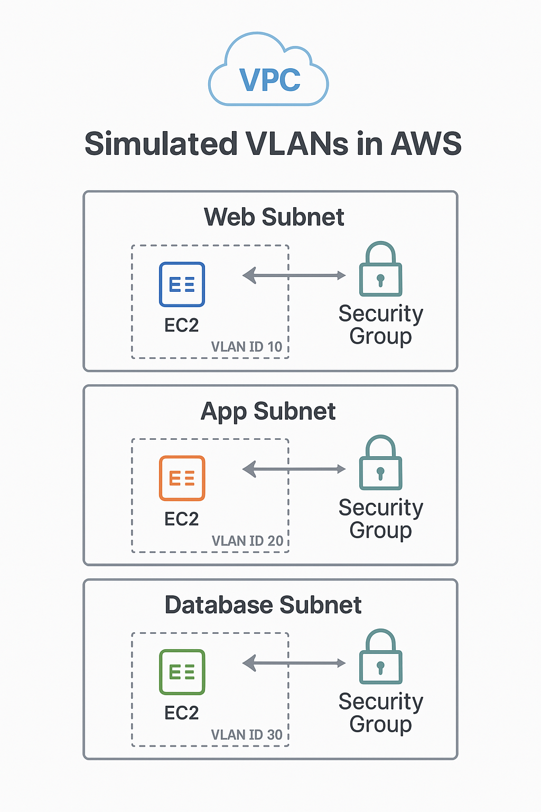
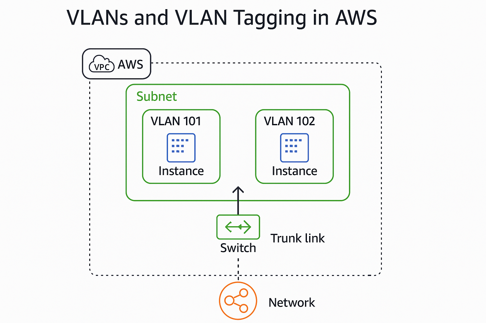
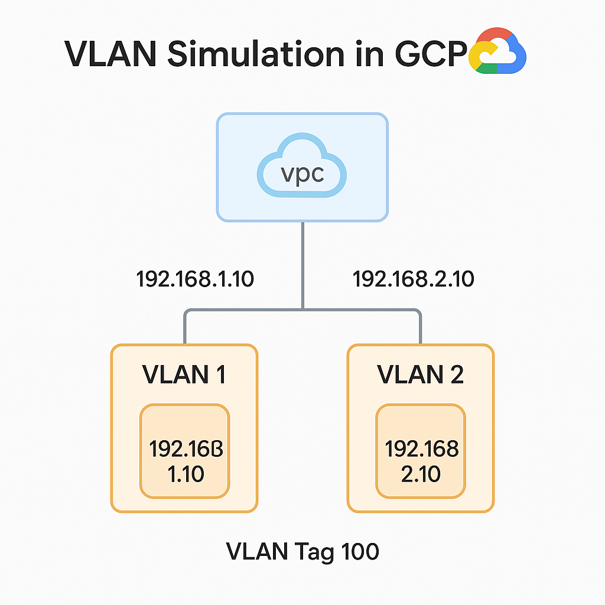

# VLAN Simulation in Public Cloud Providers

This repository provides a side-by-side overview of how VLAN concepts translate into modern public cloud platforms — AWS, Azure, and GCP. While traditional VLAN tagging (802.1Q) is not natively supported within these platforms, each provider offers ways to simulate VLAN-like segmentation using cloud-native constructs.

---

## 🔁 Quick Comparison Table

| **Feature**                  | **AWS**                    | **Azure**                  | **GCP**                    |
|-----------------------------|----------------------------|----------------------------|----------------------------|
| VLANs in Virtual Network    | ❌ Not exposed              | ❌ Not exposed              | ❌ Not exposed              |
| VLANs in Hybrid Networking  | ✅ Direct Connect           | ✅ ExpressRoute             | ✅ Interconnect             |
| Who Assigns VLAN IDs        | ✅ You (edge only)          | ✅ You (hybrid only)        | ✅ You (hybrid only)        |
| Tagging Inside Cloud        | ❌ AWS-managed              | ❌ Azure-managed            | ❌ Google-managed           |

---

## 📊 Diagrams

### AWS VLAN Simulation

---

### Azure VLAN Simulation

---

### GCP VLAN Simulation

---

Each folder contains a `README.md` with TL;DR tables and explanations for VLAN-style segmentation on that platform.
